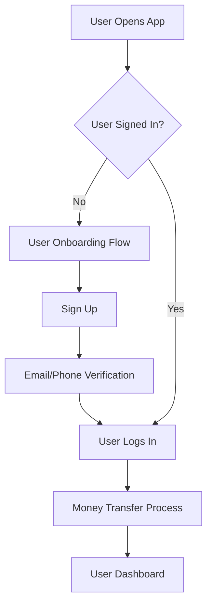

Of course! Here is a detailed, step-by-step workflow in a flowchart-like format for your fund transfer application, including both the signup and the core transaction process.

This is broken down into two main flows: **User Onboarding** and **The Money Transfer Process**.

---

### **Overall Application Workflow**

The entire user journey can be visualized in a high-level flow:

---

### **Flow 1: User Onboarding & Authentication**

**Goal:** To get a new user registered and logged into the system.

| Step | Actor | Action | System Response & Logic | Outcome/Next Step |
| :--- | :--- | :--- | :--- | :--- |
| **1.0** | User | Opens the application. | System displays the **Login Screen** with options to "Sign In" or "Sign Up". | |
| **1.1** | User | Clicks **"Sign Up"**. | System displays the **Registration Form**. | |
| **1.2** | User | Enters details: Full Name, Email, Phone Number, and creates a Password. | System validates data format in real-time e.g., valid email, strong password. | |
| **1.3** | User | Submits the form. | **System Logic:** Checks if email/phone is unique. If yes, creates a user account with status "Unverified". | |
| **1.4** | System | | Sends a one-time password (OTP) to the provided email and/or phone number. | Displays **OTP Verification Screen**. |
| **1.5** | User | Enters the received OTP. | **System Logic:** Validates the OTP. If successful, updates user status to "Verified". | |
| **1.6** | System | | Upon successful verification, automatically logs the user in and redirects to the **Main Dashboard**. | **Flow 2 begins.** |

---

### **Flow 2: Money Transfer Process**

**Goal:** To guide a logged-in user through the complete process of transferring funds from a credit card to their bank account.

| Step | Actor | Action | System Response & Logic | Outcome/Next Step |
| :--- | :--- | :--- | :--- | :--- |
| **2.0** | User | Is on the **Main Dashboard**. | System displays a "Transfer Funds" or "Make New Payment" button. | |
| **2.1** | User | Clicks **"Make New Payment"**. | System navigates to the **Payment Initiation Screen**. | |
| **2.2** | User | **Selects a Source Credit Card:**   - Chooses from a list of saved cards.   - OR clicks "Add New Card". | **If "Add New Card":**   System displays a form to enter Card Number, Expiry, CVV, Cardholder Name.   System tokenizes the card via a PCI-compliant payment gateway. Saves the token to the user's profile. | Card is now selected and available for the transaction. |
| **2.3** | User | **Selects a Destination Bank Account:**   - Chooses from a list of saved bank accounts.   - OR clicks "Add New Bank Account". | **If "Add New Bank Account":**   System displays a form for Bank Name, Account Number, IFSC Code, Account Holder Name.   System validates the IFSC and performs a micro-deposit verification if required. | Bank account is now selected. |
| **2.4** | User | Enters the **Amount** to transfer. | **System Logic:**   1. Validates amount > 0.   2. Checks if the amount is within the user's credit limit/platform limits.   3. **Calculates the Platform Fee** and the **Total Debit Amount** (Transfer Amount + Fee). | |
| **2.5** | System | | Displays a **Fee Breakdown Screen**:   - Transfer Amount: $X   - Platform Fee: $Y   - **Total Amount to be Charged: $Z**   Provides a toggle/radio button:   "Deduct fee from transfer amount" vs. "Add fee to total". | |
| **2.6** | User | Selects the **fee preference**. | **System Logic:** Recalculates the final amounts based on the user's selection.   - If "Deduct from amount", the bank receives (Transfer Amount - Fee).   - If "Add to total", the credit card is charged (Transfer Amount + Fee). | Displays the final summary. |
| **2.7** | User | Clicks **"Proceed to Pay"**. | System displays the **Terms & Conditions** and a checkbox for acceptance. | |
| **2.8** | User | Checks the "I agree to the T&C" box and confirms. | System redirects the user to the **Payment Gateway/OTP Screen**. The gateway charges the user's credit card for the total amount. | |
| **2.9** | User | On the gateway page, enters the **Credit Card OTP** and submits. | **System Logic (after OTP success):**   1. Receives a "success" response from the payment gateway.   2. Creates a new **Order/Transaction** record in the database with status: **"Under Process"**.   3. Initiates the bank transfer process on its back-end. | |
| **2.10** | System | | Redirects the user to the **Order Confirmation / Dashboard Screen**. | |
| **2.11** | User | Views the Dashboard. | System shows the new order in the "Recent Transactions" list with the status **"Under Process: You will be notified once paid."** | Process Complete. |

---

### **Key System Statuses & Backend Processes (Post-Transaction)**

*   **Under Process:** Payment from the credit card is successful, but the bank transfer has been queued.
*   **Processing:** The bank transfer is being executed by the system.
*   **Paid/Successful:** The funds have been successfully credited to the destination bank account (confirmed via webhook or bank statement).
*   **Failed:** The bank transfer failed (e.g., invalid account). A refund to the credit card is initiated.
*   **User Notification:** The system sends a push notification/email/SMS to the user when the status changes from "Under Process" to "Paid" or "Failed".
